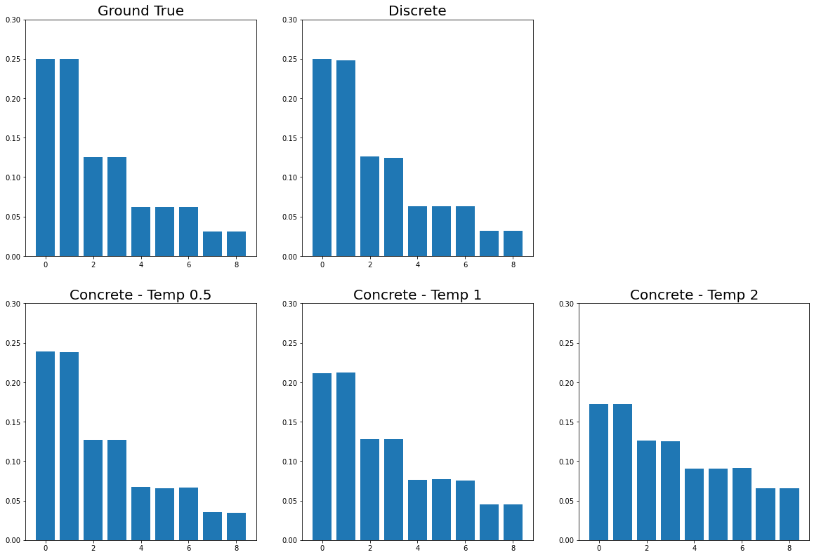
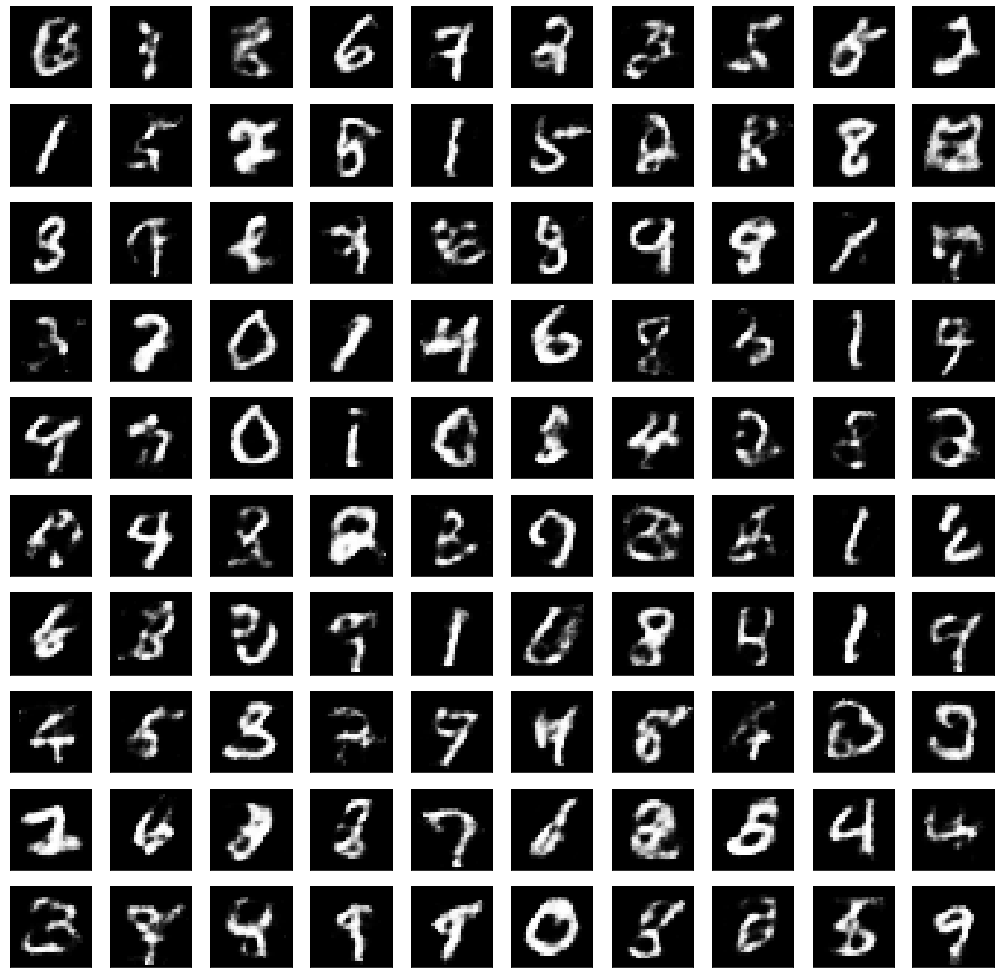

# Gumbel-Softmax Implementation with Pytorch
- Unofficial implementation of the paper *Categorical Reparameterization with Gumbel-Softmax* and *The Concrete Distribution: A Continuous Relaxation of Discrete Random Variables*
- Download binarized MNIST dataset : [[github]](https://github.com/Jasonlee1995/Binarized_MNIST)


## 0. Develop Environment
```
Docker Image
- tensorflow/tensorflow:tensorflow:2.4.0-gpu-jupyter

Library
- Pytorch : Stable (1.7.1) - Linux - Python - CUDA (11.0)
```
- Using Single GPU


## 1. Implementation Details
- dataset.py : load binarized MNIST dataset
- model.py : categorical variational autoencoder with Gumbel-Softmax
- train.py : train model
- Categorical VAE with Gumbel-Softmax.ipynb : train and inference the model
- Visualize - Concrete Distribution.ipynb : visualize distribution with sampling the real distribution on various temperature
- Details
  * Use binarized MNIST dataset for training model
  * No temperature annealing
  * Not the best result (no tuning for better result)


## 2. Results
#### 2.1. Concrete Distribution


#### 2.2. Inference Result



## 3. Reference
- Categorical Reparameterization with Gumbel-Softmax [[paper]](https://arxiv.org/pdf/1611.01144.pdf) [[official tensorflow code]](https://github.com/ericjang/gumbel-softmax)
- The Concrete Distribution: A Continuous Relaxation of Discrete Random Variables [[paper]](https://arxiv.org/pdf/1611.00712.pdf)
